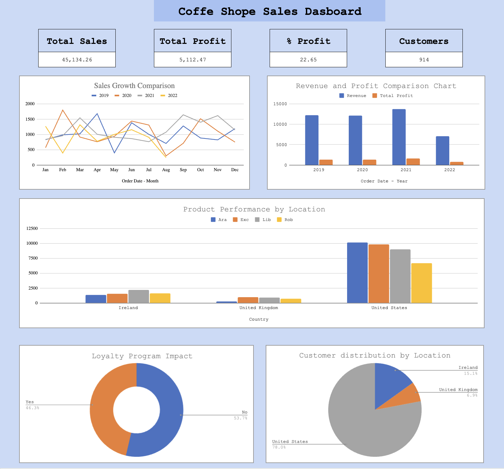
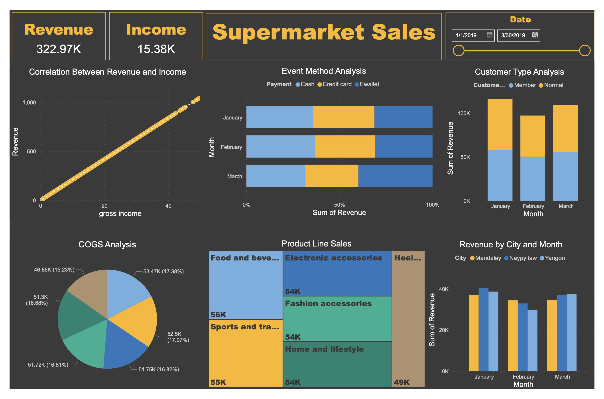

# Portfolio-Projects

## Following are my projects in SQL, Python, Tableau , Power BI , Looker & Excel:
- *You can also take a look at my Linkedin : https://www.linkedin.com/in/helen-byelyayeva/*
- *You can also take a look at my Tableau : https://public.tableau.com/app/profile/helen.byelyayeva/vizzes*

- [x] SQL & Looker  
    - Ad Analysis - This repository contains queries to analyze an advertisement campaign performance data from Facebook and Google Ads.
    - Review the PostgreSQL Script: [HERE](https://github.com/helenbyelyayeva/Portfolio-Projects/tree/main/SQL/Ads%20Analysis)
    - See on Looker Studio: [Dashboard](https://lookerstudio.google.com/reporting/42d32555-8941-456e-a257-3428a5dbde40)

- [x] SQL & Google Analytics 4
    - Ad Analysis - This repository contains SQL queries provide insights into user behavior and conversion rates, enabling businesses to make informed decisions based on their GA4 data.
    - Review the SQL Script: [HERE](https://github.com/helenbyelyayeva/Portfolio-Projects/tree/main/SQL/Big%20Query%20#google-analytics-4---data-analysis-using-bigquery)

- [x] SQL & Tableau
    - Revenue Metrics SQL & Dashboard - This repository contains queries to create views for an interactive dashboard that enables hypothetical product managers to analyze revenue metrics, track changes in revenue dynamics, and conduct high-level analysis of the factors driving these changes.
    - Review the PostgreSQL Script: [HERE](https://github.com/helenbyelyayeva/Portfolio-Projects/tree/main/SQL/Revenue%20Metric%20Analysis)
    - See Tableau Dashboards in Tableau Public: [Dashboard](https://public.tableau.com/views/Book1-Revenue2/Dashboard2?:language=en-US&:sid=&:display_count=n&:origin=viz_share_link)

- [x] Excel & Tableau
    - Cohort analysis, GameDev  - This project involves creating an analysis of player behavior, tracking key activity metrics, measuring user engagement and retention, defining cohorts based on activity time, and optimizing game design, acquisition, and monetization through data-driven insights in Google Sheets.
    - See on Google Sheets : [HERE](https://docs.google.com/spreadsheets/d/1UgnEuEwBFrbx_yGdRq5SeFAmZGfWkTxo_ayyheDXeM0/edit?usp=sharing)
    - See Tableau Dashboards in Tableau Public: [Dashboard](https://public.tableau.com/views/HW3_16918577306690/Dashboard2?:language=en-US&:sid=&:display_count=n&:origin=viz_share_link)

- [x] Tableau
    - New Users Journey Analysis  - This project involves creating a comprehensive and dynamic dashboard that visualizes user progression from registration to initial payment, showcasing essential metrics and conversion rates to provide actionable insights for strategic decision-making and business growth.
    - See Tableau Dashboards in Tableau Public: [Dashboard](https://public.tableau.com/views/hw5_17061256632210/Dashboard2?:language=en-US&:sid=&:display_count=n&:origin=viz_share_link)

- [x] Excel
    - Coffe Shope Sales  - This project involves creating a comprehensive sales dashboard for a coffee shop using Google Sheets. The dashboard integrates data from multiple sources to provide key insights into sales performance, customer behavior, and regional market analysis.
    - See on Google Sheets : [HERE](https://docs.google.com/spreadsheets/d/1GYLUjiQKDjYpvTFnKqSsYNtfC4_Ky1j688UFgRK3Hcw/edit?usp=sharing)

- [x] Python 
    - This repository showcases a diverse range of data analysis and visualization projects, demonstrating proficiency in Python programming and data manipulation techniques. From analyzing the Stackoverflow Developer Survey to exploring advertising data and application ratings, each project delves into different datasets and employs various libraries like Pandas, Matplotlib, and Seaborn. 
    - Review Script with Data Cleaning : [HERE](https://github.com/helenbyelyayeva/Portfolio-Projects/tree/main/Python/Data%20Cleaning)
    - Review Script with Data Analysis : [HERE](https://github.com/helenbyelyayeva/Portfolio-Projects/tree/main/Python/Data%20Analysis)
    - Review Script with Data Visualization : [HERE](https://github.com/helenbyelyayeva/Portfolio-Projects/tree/main/Python/Data%20Visualization%20)

- [x] Power BI
    -  Supermarket Sales Analysis Dashboards  - This project provides a comprehensive analysis of supermarket transactions, customer demographics, and sales performance using a variety of interactive dashboards.
    - See all information about project: [HERE](https://github.com/helenbyelyayeva/Portfolio-Projects/tree/main/PowerBI)

    
