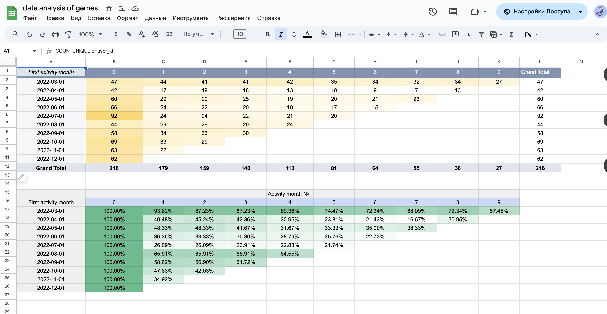

# Portfolio-Projects
## Following are my projects in SQL, Python, Tableau , Power BI , Looker & Excel:
- *You can also take a look at my Linkedin : https://www.linkedin.com/in/helen-byelyayeva/*
- *You can also take a look at my Tableau* : https://public.tableau.com/app/profile/helen.byelyayeva/vizzes*

- [x] SQL & Looker  
    - Ad Analysis - This repository contains queries to analyze an advertisement campaign performance data from Facebook and Google Ads.
    - Review the PostgreSQL Script: [HERE](https://github.com/helenbyelyayeva/Portfolio-Projects/tree/main/SQL/Ads%20Analysis)
    - See on Looker Studio: [Dashboard](https://lookerstudio.google.com/reporting/42d32555-8941-456e-a257-3428a5dbde40)

- [x] SQL & Tableau
    - Revenue Metrics SQL & Dashboard - This repository contains queries to create views for an interactive dashboard that enables hypothetical product managers to analyze revenue metrics, track changes in revenue dynamics, and conduct high-level analysis of the factors driving these changes.
    - Review the PostgreSQL Script: [HERE](https://github.com/helenbyelyayeva/Portfolio-Projects/tree/main/SQL/Revenue%20Metric%20Analysis)
    - See on Tableau Public: [Dashboard](https://public.tableau.com/views/Book1-Revenue2/Dashboard2?:language=en-US&:sid=&:display_count=n&:origin=viz_share_link)

- [x] Excel & Tableau

    - See on Tableau Public: [Dashboard](https://public.tableau.com/views/HW3_16918577306690/Dashboard2?:language=en-US&:sid=&:display_count=n&:origin=viz_share_link)

    

        
    

    

        
    

